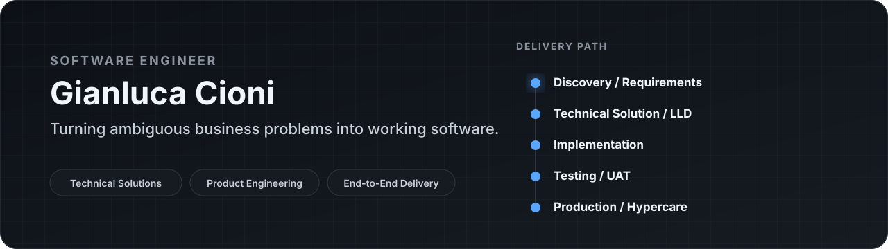
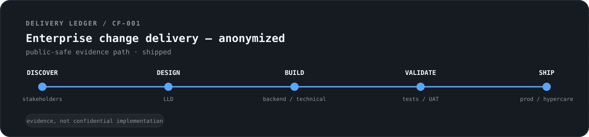

**Software Engineer** working across technical solutions, product engineering, customer/stakeholder discovery, system design, hands-on implementation, validation, and production delivery.

[gianlucacioni.com](https://gianlucacioni.com) · [LinkedIn](https://www.linkedin.com/in/gianluca-cioni/) · Rome, Italy

## Operating model

I work best where technical execution meets ambiguity: clarify the real problem, translate constraints into a solution, build it, validate it with users, and support the path into production.

`Discovery / Requirements` → `Technical Solution / LLD` → `Implementation` → `Testing / UAT` → `Production / Hypercare`

*Scope varies by project; this is the delivery range I operate across, not a claim that every engagement covers every stage.*

## Delivery Ledger

Most client production code and architecture cannot be published. The **Delivery Ledger** uses only evidence with a clear provenance: sanitized professional delivery, genuine public artifacts, decision records, and engineering field notes extracted from real system constraints.

**[Open the Delivery Ledger →](./delivery-ledger/README.md)**

- **[CF-001 · Enterprise change delivery — anonymized](./delivery-ledger/casefiles/CF-001-enterprise-change-delivery/README.md)** — stakeholder clarification → LLD → implementation → UAT → production support.
- **[CF-002 · Connecting Beyond system architecture — prior art](./delivery-ledger/casefiles/CF-002-connecting-beyond-prior-art/README.md)** — a dated public technical specification covering data modeling, license lifecycle, intermediary activation, state resolution, concurrency-safe claiming, security controls, and API design. **[Inspect the original publication →](https://github.com/G-Cioni/sys-arch-doc)**
- **[DR-001 · Rights before resources exist](./delivery-ledger/decision-records/DR-001-rights-before-resources-exist/README.md)** — one-use creation authority → atomic consumption → durable participation; includes rejected alternatives, failure modes, model evolution, and explicit AI-assistance provenance.
- **[FN-001 · Rate limiting shared networks](./delivery-ledger/field-notes/FN-001-rate-limiting-shared-networks/README.md)** — why strict IP-only limiting fails when many legitimate users share one connection, and how to choose limiter keys from the abuse identity instead.

## Selected proof

### Enterprise solution delivery — anonymized

**Stakeholder clarification · LLD · Backend implementation · Testing/UAT · Production/Hypercare**

- Clarified operational requirements and business constraints directly with client stakeholders in English.
- Authored Low-Level Design documentation translating business requirements into the technical solution and implementation approach.
- Implemented backend and technical changes while collaborating across frontend, UX/UI, QA, and project management.
- Structured test scenarios, supported UAT, production release, and post-release hypercare.

### [Connecting Beyond](https://connectingbeyond.com) — product architecture & independent execution

**Product architecture · Full-stack implementation · Data/Auth/Storage · Deployment · UX**

- Co-founded and built the product across architecture, full-stack implementation, data/auth/storage flows, deployment, and UX.
- Co-authored a public prior-art technical specification documenting one of the product's offline-to-online license and physical-media mechanisms: [system architecture disclosure](https://github.com/G-Cioni/sys-arch-doc).

### [Koordinato](https://koordinato.com) — 0→1 hospitality product work

**Domain discovery · AI-assisted workflows · Full-stack pilot · Operator validation**

- Used hospitality domain discovery and operator conversations to map real workflow friction.
- Designed AI-assisted operational workflows and built a working pilot for validation with hotel operators.
- Worked across product design, application flows, data architecture, implementation, and feedback-driven iteration.

## Engineering toolkit

`TypeScript` · `JavaScript` · `Java` · `Python`  
`React` · `Next.js` · `Spring Boot` · `Node.js` · `FastAPI`  
`PostgreSQL` · `Docker` · `Git/GitHub` · `Automated testing`

## AI as engineering leverage

I use modern AI systems and developer agents to increase delivery speed, exploration capacity, test coverage, and documentation quality. Architecture, trade-offs, verification, and production decisions remain grounded in engineering judgment.

## Customer-facing foundation

Before software engineering, I worked in hospitality and real estate. That background remains useful in technical delivery: active listening, clear customer communication, comfort with ambiguity and pressure, and commercial context.
