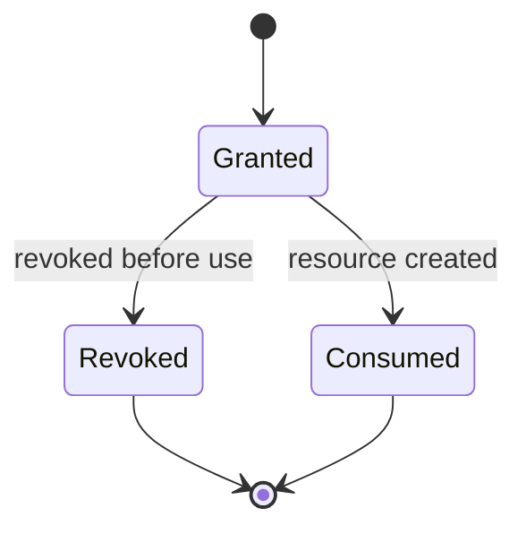

# DR-001 · Rights before resources exist

**Decision record · public-safe abstraction from a real product system**

Some permission problems begin before the thing being permissioned exists.

This record documents one such case: allowing an authorized third party to create a resource on behalf of its owner, without confusing temporary creation authority with permanent ownership or editing rights.

## The problem

The existing permission model worked **after** a resource existed: an owner could grant another actor participation rights on that resource.

A new workflow introduced a harder requirement:

> How do you authorize somebody to create the resource when there is no resource yet to attach the permission to?

The solution also had to preserve several invariants:

- the eventual owner remains the owner;
- creation authority can be revoked before use;
- a creation grant cannot be replayed after it has been used;
- two concurrent attempts must not create two resources from the same entitlement;
- if the owner creates the resource first, outstanding creation authority must no longer remain usable;
- after creation, persistent access should be represented by the ordinary participation model rather than by the temporary creation grant;
- the system needs an audit trail for who acted, when, and on whose behalf.

## Why the obvious approaches were weak

### Pre-create an empty resource

This would make permissions easy because there would already be an object to attach them to.

It also creates artificial state: an object exists before the user has actually created it, which complicates drafts, ownership semantics, cleanup, visibility, and lifecycle reasoning.

### Add a reusable global role

A global capability such as “may create on behalf of owners” is too broad. The authority needed to be scoped to one specific future resource and to expire after use.

### Treat the invitation itself as permanent permission

That mixes two different concerns:

1. temporary authority to perform creation;
2. persistent access after creation.

Those lifecycles should not be represented by the same object.

## Decision

Introduce a **temporary pre-creation grant** whose lifecycle is separate from the eventual resource permission model.



At creation time, the system crosses one transactional boundary:

```text
validate creation authority
        ↓
create resource for the owner
        ↓
consume the temporary grant
        ↓
create the persistent participation relationship
        ↓
record acting identity / audit context
```

The key property is **consumption**. A successful creation changes the grant from “may create” to “has been used,” while normal post-creation permissions move into the durable participation model.

## Evolution of the model

The design became stricter as the real operating model became clearer.

An early version treated delegation primarily as authority granted to an individual editor. The later requirement clarified that, for partner workflows, the durable editing relationship belonged to the **partner/collaborator entity**, not to one particular employee account.

That changed an important boundary:

- **temporary creation authority** remains a one-use lifecycle concern;
- **persistent editor access** belongs to the normal partner/resource participation model.

This avoided accidentally making one employee account the permanent representation of an organizational relationship.

## Failure modes the design explicitly addresses

### Double creation

Two requests must not both succeed against the same future-resource entitlement.

The implementation therefore treats validation, creation, consumption and participation creation as one atomic operation, with concurrency protection around the one-use entitlement.

### Owner creates first

If the owner creates directly while a delegation exists, the delegation must no longer be usable.

### Revoked grant is replayed

Revocation is terminal. A revoked creation grant cannot later become valid because another state changes.

### Partial success

It is unacceptable to create the resource but fail to consume the grant, or consume the grant without creating the resource. The transition therefore needs all-or-nothing semantics.

### Permission leakage after creation

The temporary grant is not reused as the permanent permission object. Persistent editing rights are represented independently after creation.

## Verification strategy

The private implementation is backed by tests around the behaviors that matter rather than only the happy path:

- grant creation;
- revocation;
- one-time consumption;
- authorization boundaries;
- owner-direct creation;
- conflict handling;
- post-creation participation;
- invalid and already-used states.

The exact private schema, repository paths, API routes, locking details and customer-specific workflow are intentionally not reproduced here.

## Provenance

The underlying requirements and several hard architecture constraints were **defined and refined by Gianluca Cioni**: temporary creation delegation, separation from persistent editor access, collaborator-level rather than employee-level durable access, reuse/revocation behavior, and preservation of the ordinary participation model after creation.

Implementation was developed in an **AI-assisted engineering workflow** and then iterated against those requirements and automated tests. This record is therefore evidence of requirement decomposition, architecture decisions, lifecycle modeling and verification — **not a claim that every implementation line was manually authored**.

## What this demonstrates

- turning a product workflow into explicit system invariants;
- modeling authority that exists before its target resource;
- separating temporary capability from durable permission;
- reasoning about concurrency and one-time state transitions;
- preserving ownership and audit semantics across a lifecycle boundary;
- correcting the model when the real organizational relationship became clearer.

That is the point of this record: not the internal implementation, but the engineering decision that makes the implementation coherent.
